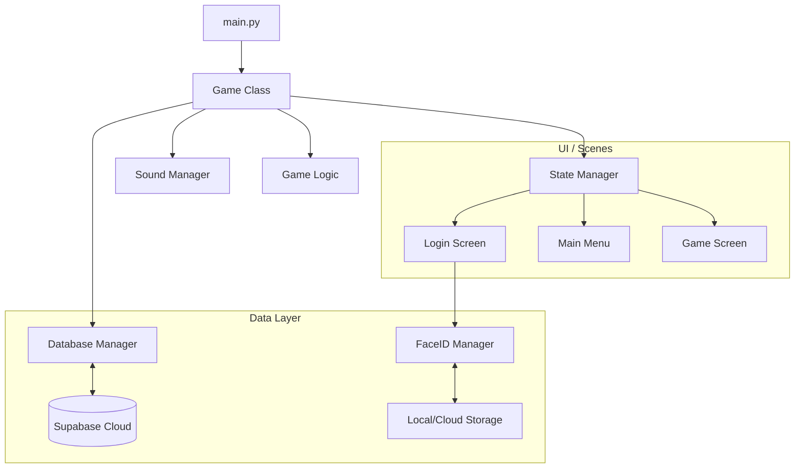

# Lucky Race Game 🏁


**Lucky Race Game** is an engaging betting simulation game built with Python and Pygame. It features a robust user management system, secure authentication (including Face ID), and real-time data synchronization using Supabase. Players can place bets on racing characters, use items to influence the race, and track their history in a competitive environment.

## 📖 Table of Contents

- [Introduction](#introduction)
- [Key Features](#key-features)
- [Architecture](#overall-architecture)
- [Folder Structure](#folder-structure)
- [Prerequisites](#prerequisites)
- [Installation](#installation)
- [Configuration](#configuration)
- [Running the Project](#running-the-project)
- [Roadmap](#roadmap)
- [Contributing](#contribution-guidelines)
- [License](#license)

## Introduction

Refactored from a university final project for *Introduction to Information Technology*, this application demonstrates modern software architecture patterns in game development. It moves beyond simple scripts to a structured, scalable application featuring:

- **MVC-inspired Architecture**: Separation of concerns between game logic, UI rendering, and data management.
- **Cloud Integration**: User data, game history, and authentication are managed via Supabase.
- **Advanced Auth**: Support for traditional username/password login and biometric Face ID verification.

## Key Features

- **🔐 Secure Authentication**:
    - Sign up and Log in with email verification support.
    - **Face ID Login**: Login using facial recognition powered by OpenCV.
    - Password recovery flows (Forgot Password, Change Password).
- **🏇 Betting System**:
    - Dynamic betting interface.
    - Real-time balance updates.
    - Win/Loss calculation based on race results.
- **🛍️ Item Shop**:
    - Purchase consumables to affect race outcomes (Speed Up, Slow Down, etc.).
    - Inventory management.
- **📊 User Profile & History**:
    - Track betting history and race results.
    - Persistent user statistics (Total races, items used).
- **⚙️ Settings**:
    - Multi-language support (English/Vietnamese).
    - Audio volume control.

## Overall Architecture

The project follows a component-based architecture using a State Manager to handle transitions between different screens (scenes).

### High-Level Diagram



### Core Components

- **Game Class** (`src/core/game.py`): The central controller that initializes Pygame, loads assets, and runs the main loop.
- **State Manager** (`src/core/state_manager.py`): Manages transitions between screens (Login -> Main Menu -> Game).
- **Database Manager** (`src/database/db_manager.py`): Handles all CRUD operations with Supabase.
- **Face ID Manager** (`src/utils/face_recognition_utils.py`): Wraps OpenCV and `face_recognition` for biometric auth.

## Folder Structure

```
project/
├── .env.example            # Template for environment variables
├── requirements.txt        # Python dependencies
├── src/
│   ├── config/             # Configuration settings (constants, paths)
│   ├── core/               # Core game logic (Game loop, State Manager)
│   ├── database/           # Supabase integration layer
│   ├── models/             # Data models (User, Item)
│   ├── screens/            # UI implementation for each screen
│   ├── utils/              # Helpers (Face ID, Drawing, File I/O)
│   └── main.py             # Entry point
└── assets/                 # Game assets (Images, Sounds, Fonts)
```

## Prerequisites

- **Python 3.9+**
- **Supabase Account**: You need a Supabase project for the database and authentication.
- **Webcam**: Required for Face ID features.

## Installation

1.  **Clone the repository**

    ```bash
    git clone https://github.com/ducquan19/the-race-bet.git
    cd the-race-bet
    ```

2.  **Create a Virtual Environment** (Recommended)

    ```bash
    python -m venv venv
    # Windows
    .\venv\Scripts\activate
    # macOS/Linux
    source venv/bin/activate
    ```

3.  **Install Dependencies**

    ```bash
    pip install -r requirements.txt
    ```

    *Key dependencies include `pygame`, `supabase`, `opencv-python`, `face_recognition`.*

## Configuration

1.  **Supabase Setup**
    - Create a new project on [Supabase](https://supabase.com).
    - Run the SQL migrations found in `supabase/migrations` (or manually create `users`, `game_runs`, `game_scores` tables).
    - Enable Auth providers (Email/Password).

2.  **Environment Variables**
    - Copy `.env.example` to `.env`:
        ```bash
        cp .env.example .env
        ```
    - Update `.env` with your Supabase credentials:
        ```ini
        SUPABASE_URL=https://your-project.supabase.co
        SUPABASE_ANON_KEY=your-anon-key
        SUPABASE_SERVICE_KEY=your-service-role-key # For admin tasks
        ```

## Running the Project

To start the game, run the main script from the `src` directory:

```bash
python src/main.py
```

## Roadmap

- [ ] **Multiplayer Mode**: Real-time racing against other players via WebSocket.
- [ ] **Mobile Port**: Android/iOS version using Kivy or BeeWare.
- [ ] **Leaderboard**: Global high scores.
- [ ] **Skin System**: Customizable characters and track skins.
- [ ] **Music & SFX**: Enhanced audio experience.

## Contribution Guidelines

We welcome contributions! Please follow these steps to contribute:

1.  **Fork** the repository.
2.  Create a **new branch** for your feature or fix (`git checkout -b feature/amazing-feature`).
3.  **Commit** your changes (`git commit -m 'Add some amazing feature'`).
4.  **Push** to the branch (`git push origin feature/amazing-feature`).
5.  Open a **Pull Request**.

### Code Style
- Follow **PEP 8** guidelines.
- Use type hints (`typing` module) for function arguments and return values.
- Document classes and functions using docstrings.

## License

This project is licensed under the MIT License - see the [LICENSE](LICENSE) file for details.

---

<p align="center">
  Built with ❤️ by the Lucky Race Team
</p>
